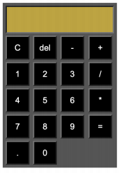

# calculadora
Trabalho A2-U

Instruções:
- Crie conforme a imagem a calculadora utilizando apenas ferramentas front-end
  (HTML, CSS e JS).
- Existem muitos exemplos prontos na internet que podem ser utilizados como
  referência, mas no de vocês quero criem as classes e variáveis com nomes lógicos,
  em português e definidos por vocês, caso contrário vou desconsiderar o trabalho.
- Reproduza as cores e tamanhos o mais próximo possível da imagem.
- Serão 3 arquivos, um de HTML, outro com o CSS e outro como JS.
- O Java Script (JS) é que faz a parte do display.
- Construa um código limpo com as variáveis bem identificadas.
- O display deve ser bloqueado impedindo que sejam inseridos dados direto nele. Só
  podem entrar valores digitados no teclado da calculadora.
- Para ajudar nas cores pode utilizar essa ferramenta da Adobe:
  https://color.adobe.com/pt/create/color-wheel

